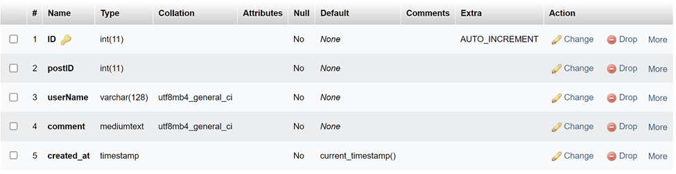
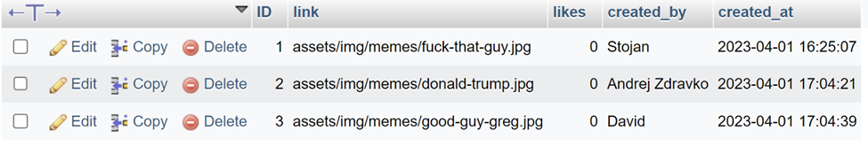
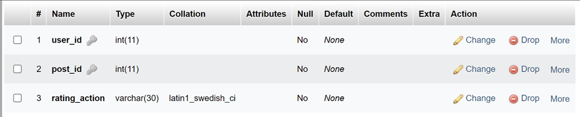
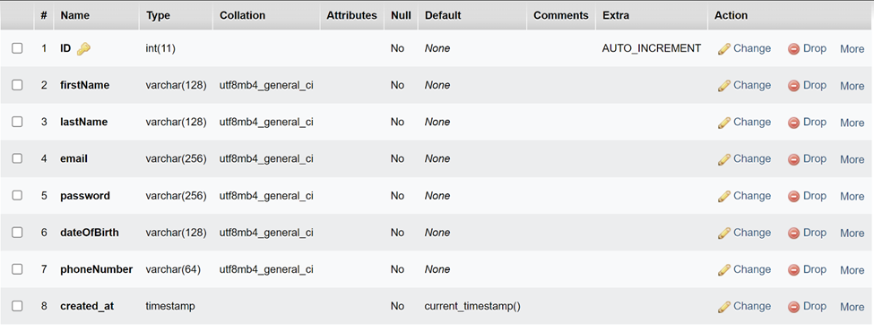

# Deep Meme
## based on meme templates and their captions

The platform requires XAMPP to run, so here are screenshots of what you need to have in the database.

Posts Table:

Rating Info:

Users:

Platform functionality:
* Meme Generation
* Caption Generation based on Machine Learning (ResNet-50 and LSTM)
* Memes can be posted on the feed where they can be liked, and added to favorites